# Unity Interactive SCA

Interactive Space colonization algorithm in Unity.

Currently a playable prototype. Try in to itch.io: https://lovbos.itch.io/interactive-abstract-tree-growth

### Gallery

#### Grow example

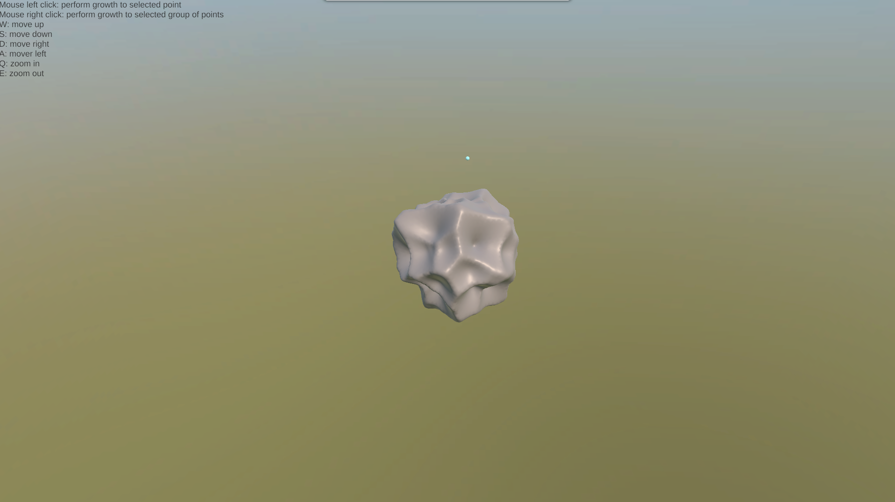
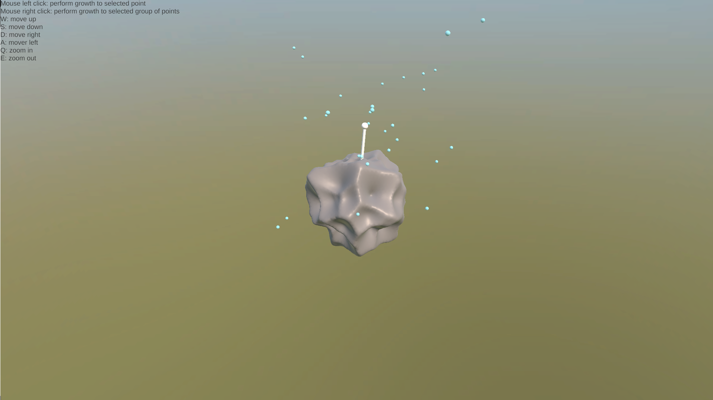
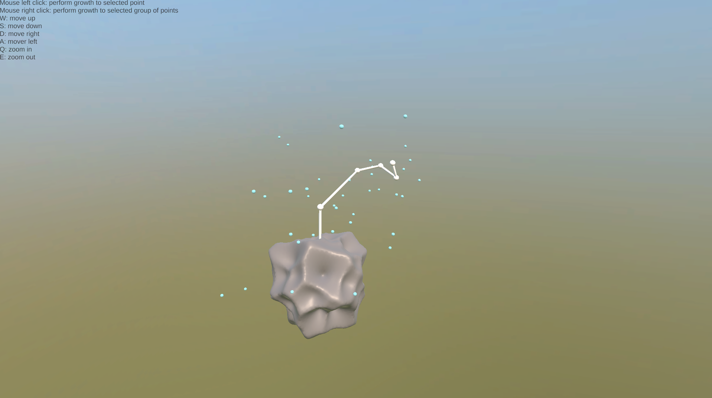
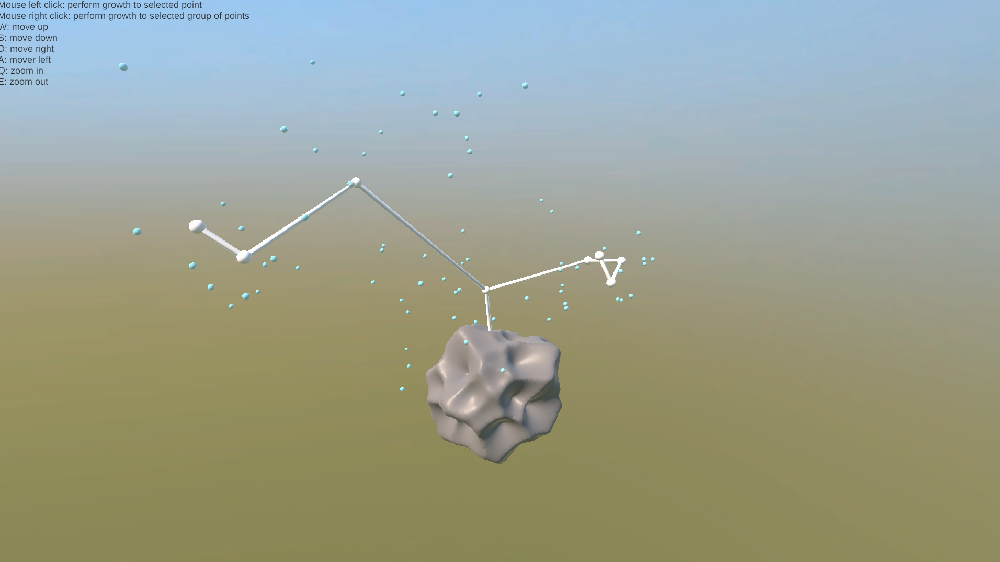
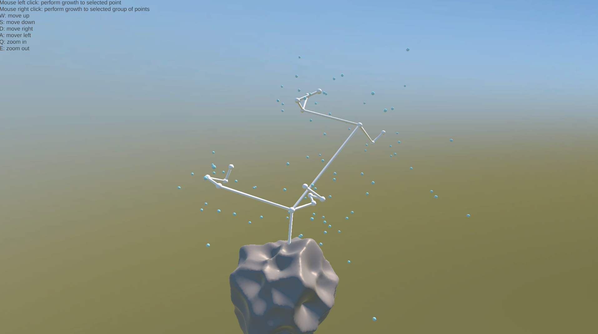
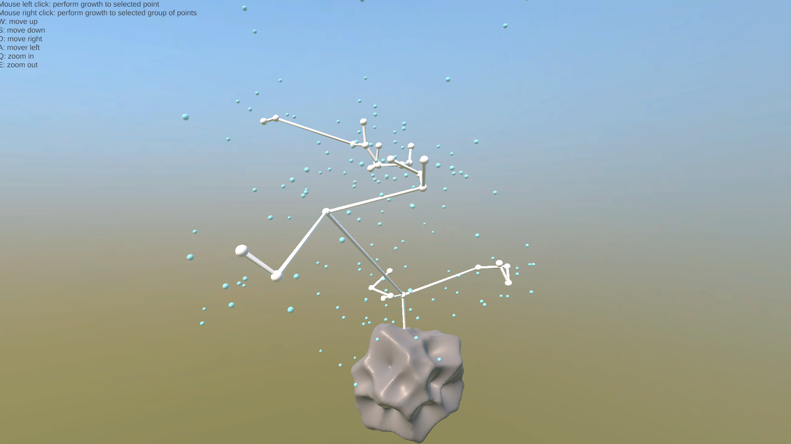
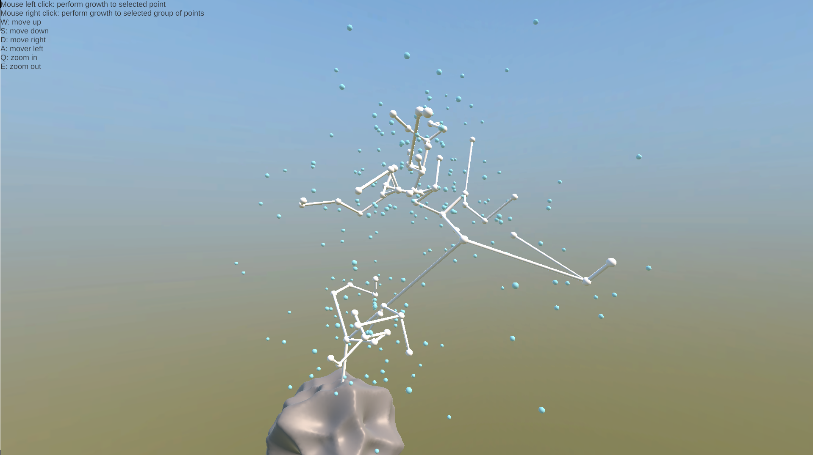
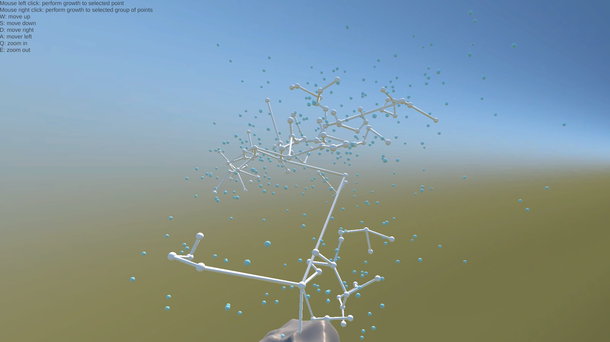

#### Dev images

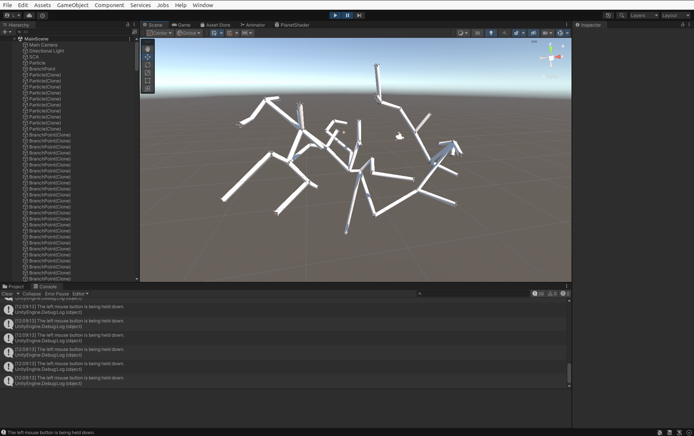
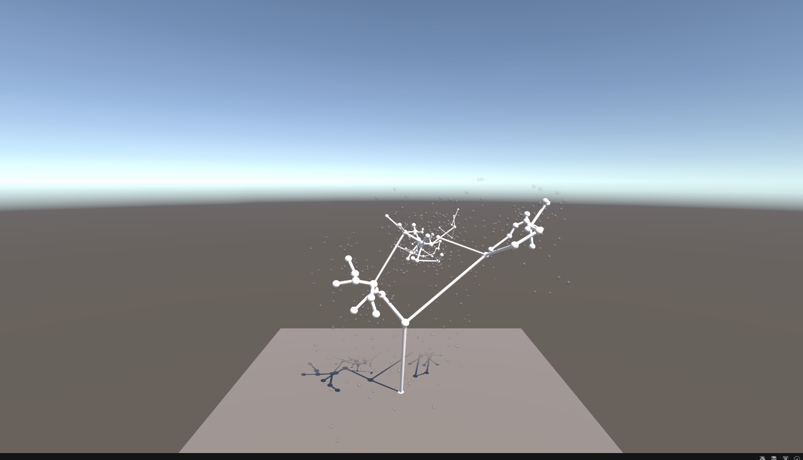
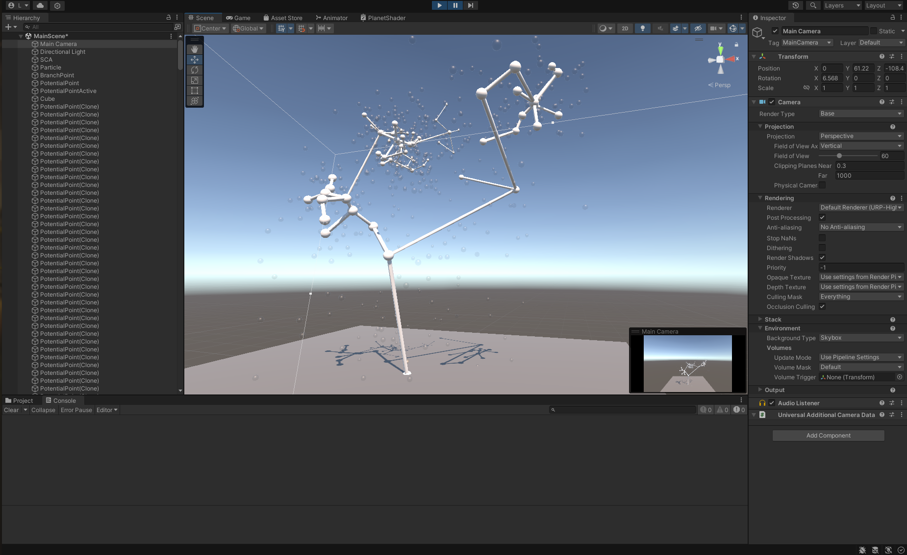

### Features
* Implemented interactive SCA for growing abstract trees
* On-the-fly mesh generation for each branch growth
* Interactive point growth
* Interactive group of points growth
* Spawning of additional points for growth
* Selection preview
* Movement controller

### Improvables:
* Smoother `camera-to` transform 
* Adding leafs
* Scaling edges based on parent
* Gameplay: number of branches, goal
* START/EXIT screen
* edge mesh connectivity
* Code refactoring (see comments)